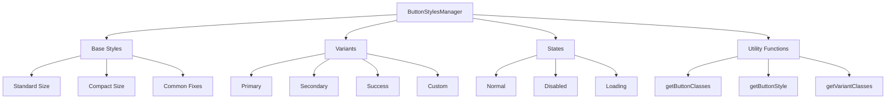

# Design Document

## Overview

The ButtonStylesManager is a centralized styling system designed to eliminate code duplication and provide consistent button styling across the restaurant-roulette application. The system will maintain full compatibility with the existing theme system while providing a clean, maintainable API for button styling.

Based on analysis of the current codebase, the following patterns are repeated across multiple components:
- Button dimensions: `h-[72px] p-3 rounded-lg border-2` (standard size)
- Theme gradients: `linear-gradient(135deg, var(--theme-primary), var(--theme-accent))`
- Common fixes: `margin: 0`, `touchAction: 'manipulation'`
- State management: opacity and cursor changes for disabled/loading states

## Architecture

The ButtonStylesManager follows a functional approach using plain JavaScript objects and utility functions, maintaining compatibility with the existing CDN-based React architecture without requiring a build process.

### Core Components



## Components and Interfaces

### 1. ButtonStylesManager Core Object

```javascript
const ButtonStylesManager = {
  // Base style constants
  base: {
    standard: 'h-[72px] p-3 rounded-lg border-2 flex flex-col items-center justify-center shadow-lg transition-all duration-200',
    compact: 'h-12 p-2 rounded-md border flex items-center justify-center shadow-md transition-all duration-200',
    fixes: { 
      margin: 0, 
      touchAction: 'manipulation' 
    }
  },

  // Theme-compatible variants
  variants: {
    primary: {
      background: 'linear-gradient(135deg, var(--theme-primary), var(--theme-accent))',
      borderColor: 'var(--theme-primary)',
      color: 'var(--text-primary)'
    },
    secondary: {
      background: 'var(--surface-color)',
      borderColor: 'var(--border-color)', 
      color: 'var(--text-secondary)'
    },
    success: {
      background: 'var(--success-color)',
      borderColor: 'var(--success-color)',
      color: 'white'
    },
    custom: {
      // Allows for runtime customization
      background: null,
      borderColor: null,
      color: null
    }
  },

  // State management
  states: {
    normal: { 
      opacity: 1, 
      cursor: 'pointer' 
    },
    disabled: { 
      opacity: 0.3, 
      cursor: 'not-allowed' 
    },
    loading: { 
      opacity: 0.5, 
      cursor: 'wait' 
    }
  }
}
```

### 2. Utility Functions

#### getButtonClasses(variant, size)
Returns Tailwind CSS classes for the specified variant and size.

```javascript
getButtonClasses: (variant = 'primary', size = 'standard') => {
  const baseClasses = ButtonStylesManager.base[size];
  const variantClasses = ButtonStylesManager.getVariantClasses(variant);
  return `${baseClasses} ${variantClasses}`;
}
```

#### getButtonStyle(options)
Returns inline styles object for complete button styling.

```javascript
getButtonStyle: (options = {}) => {
  const {
    variant = 'primary',
    state = 'normal',
    customColors = {},
    ignoreDisabled = false
  } = options;

  const variantStyle = variant === 'custom' 
    ? customColors 
    : ButtonStylesManager.variants[variant];
  
  const stateStyle = ButtonStylesManager.states[state];
  
  return {
    ...variantStyle,
    ...stateStyle,
    ...ButtonStylesManager.base.fixes
  };
}
```

### 3. Backward Compatibility Layer

To ensure smooth migration, the system provides compatibility wrappers for existing button logic:

```javascript
// Compatibility wrapper for existing getAddButtonStyle function
const createCompatibleButtonLogic = (originalLogic) => {
  return {
    ...originalLogic,
    getAddButtonStyle: (customBackground, customTextColor, ignoreOperationalStatus) => {
      if (customBackground || customTextColor) {
        return ButtonStylesManager.getButtonStyle({
          variant: 'custom',
          customColors: {
            background: customBackground,
            color: customTextColor
          },
          state: ignoreOperationalStatus ? 'normal' : 'disabled'
        });
      }
      
      return ButtonStylesManager.getButtonStyle({
        variant: 'primary',
        state: ignoreOperationalStatus ? 'normal' : 'disabled'
      });
    }
  };
};
```

## Data Models

### ButtonOptions Interface
```typescript
interface ButtonOptions {
  variant?: 'primary' | 'secondary' | 'success' | 'custom';
  size?: 'standard' | 'compact';
  state?: 'normal' | 'disabled' | 'loading';
  customColors?: {
    background?: string;
    borderColor?: string;
    color?: string;
  };
  ignoreDisabled?: boolean;
}
```

### ThemeVariant Interface
```typescript
interface ThemeVariant {
  background: string;
  borderColor: string;
  color: string;
}
```

### ButtonState Interface
```typescript
interface ButtonState {
  opacity: number;
  cursor: string;
}
```

## Error Handling

### 1. Invalid Variant Handling
```javascript
getButtonStyle: (options = {}) => {
  const { variant = 'primary' } = options;
  
  if (!ButtonStylesManager.variants[variant]) {
    console.warn(`Invalid button variant: ${variant}. Using 'primary' as fallback.`);
    variant = 'primary';
  }
  
  // Continue with valid variant
}
```

### 2. Missing CSS Variables
The system gracefully handles missing CSS variables by providing fallback values:

```javascript
variants: {
  primary: {
    background: 'linear-gradient(135deg, var(--theme-primary, #dc143c), var(--theme-accent, #ffd700))',
    borderColor: 'var(--theme-primary, #dc143c)',
    color: 'var(--text-primary, #ffffff)'
  }
}
```

### 3. Runtime Error Protection
```javascript
const safeGetButtonStyle = (options) => {
  try {
    return ButtonStylesManager.getButtonStyle(options);
  } catch (error) {
    console.error('ButtonStylesManager error:', error);
    // Return safe fallback styles
    return {
      background: '#dc143c',
      borderColor: '#dc143c',
      color: 'white',
      margin: 0,
      touchAction: 'manipulation',
      opacity: 1,
      cursor: 'pointer'
    };
  }
};
```

## Testing Strategy

### 1. Unit Tests
- Test all utility functions with various input combinations
- Verify CSS variable integration
- Test error handling and fallback scenarios
- Validate backward compatibility wrappers

### 2. Integration Tests
- Test with existing components (SlotMachine, MealTimeSelector, etc.)
- Verify theme switching functionality
- Test responsive behavior across different screen sizes
- Validate touch interaction functionality

### 3. Visual Regression Tests
- Compare button appearances before and after migration
- Test all theme variants (maizuru, qisu, muluInn)
- Verify button states (normal, disabled, loading)
- Test button sizes (standard, compact)

### 4. Performance Tests
- Measure style calculation performance
- Test memory usage with large numbers of buttons
- Verify no performance regression compared to current implementation

### 5. Compatibility Tests
```javascript
// Test existing button logic compatibility
const testCompatibility = () => {
  const originalStyle = originalButtonLogic.getAddButtonStyle('#ff0000', 'white', true);
  const newStyle = ButtonStylesManager.getButtonStyle({
    variant: 'custom',
    customColors: { background: '#ff0000', color: 'white' },
    state: 'normal'
  });
  
  // Verify styles match expected behavior
  assert.equal(originalStyle.background, newStyle.background);
  assert.equal(originalStyle.color, newStyle.color);
};
```

## Migration Strategy

### Phase 1: Core Implementation
1. Create `components/shared/ButtonStylesManager.js`
2. Implement core utility functions
3. Add comprehensive error handling
4. Create compatibility wrappers

### Phase 2: Component Migration
1. Update `SlotMachine.js` to use ButtonStylesManager
2. Migrate `MealTimeSelector.js` button styles
3. Update `DistanceControl.js` and other SearchSettings components
4. Migrate LocationManager button components

### Phase 3: Cleanup and Optimization
1. Remove duplicate style definitions
2. Update documentation
3. Performance optimization
4. Final testing and validation

## Theme Integration

The ButtonStylesManager seamlessly integrates with the existing theme system by:

1. **CSS Variable Compatibility**: All variants use existing CSS variables like `--theme-primary`, `--theme-accent`
2. **Theme Event Handling**: Automatically responds to theme changes via the existing `themeChanged` event
3. **Fallback Support**: Provides fallback colors for each theme in case CSS variables are unavailable

```javascript
// Theme change handler
window.addEventListener('themeChanged', (event) => {
  // ButtonStylesManager automatically uses updated CSS variables
  // No additional handling required due to CSS variable usage
});
```

## Performance Considerations

1. **Lazy Evaluation**: Style calculations are performed only when needed
2. **Memoization**: Frequently used style combinations are cached
3. **Minimal DOM Impact**: Uses existing Tailwind classes where possible
4. **CSS Variable Efficiency**: Leverages browser-native CSS variable system

## Security Considerations

1. **Input Validation**: All user inputs are validated before use
2. **XSS Prevention**: No direct HTML injection, only CSS property values
3. **Safe Defaults**: Always provide safe fallback values
4. **Type Safety**: Runtime type checking for critical parameters