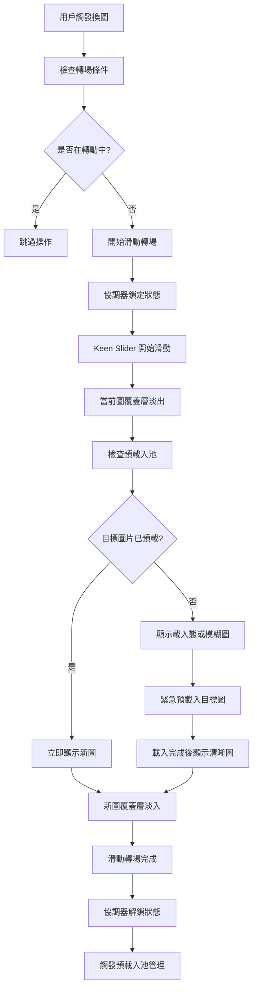
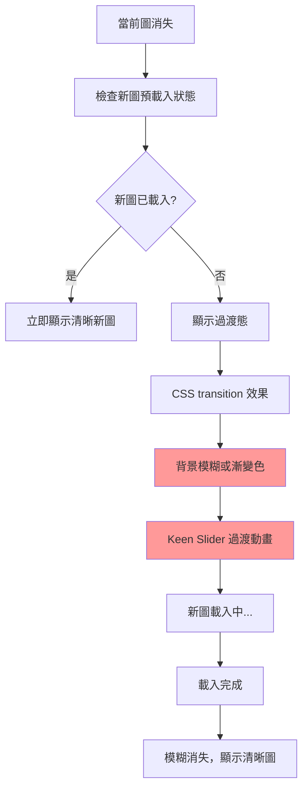
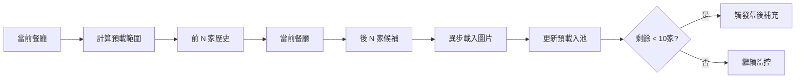
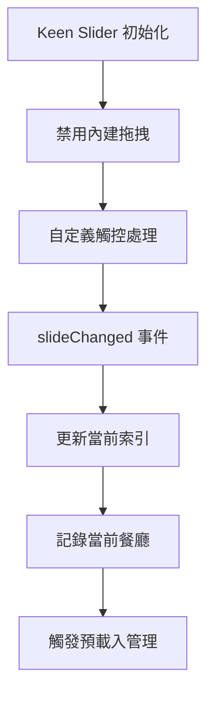
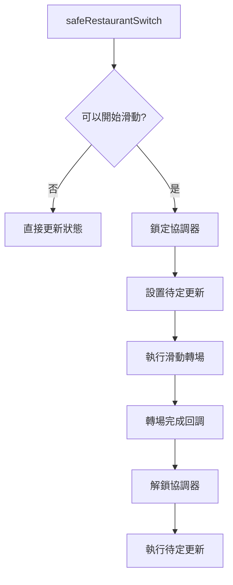
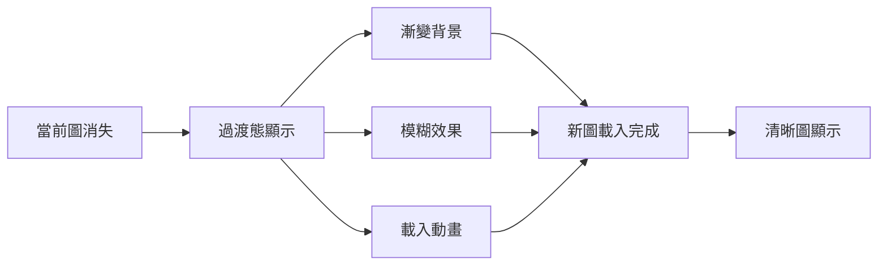

# 餐廳圖片換圖流程分析

## 概述
Restaurant Roulette 使用 Keen Slider 處理餐廳圖片的轉場效果，包含智能預載入池和滑動轉場動畫。

## 主要流程

### 圖片換圖完整流程



### 模糊畫面出現原因



## 核心組件分析

### 1. SlotMachine.js 圖片渲染邏輯 (components/SlotMachine.js:724-737)

```javascript
backgroundImage: (() => {
  // 檢查預載入池
  if (restaurant.image && preloadPool.has(restaurant.image)) {
    const poolItem = preloadPool.get(restaurant.image);
    if (poolItem.isLoaded && poolItem.imageObject) {
      // 使用預載入的圖片
      return `linear-gradient(rgba(0,0,0,var(--image-overlay-opacity)), rgba(0,0,0,var(--image-overlay-opacity))), url(${poolItem.imageObject.src})`;
    }
  }
  
  // 回退到原始圖片或漸變背景
  return restaurant.image 
    ? `linear-gradient(rgba(0,0,0,var(--image-overlay-opacity)), rgba(0,0,0,var(--image-overlay-opacity))), url(${restaurant.image})`
    : 'linear-gradient(135deg, #fbbf24 0%, #f59e0b 100%)';
})()
```

### 2. 智能預載入池管理 (components/AdvancedPreloader.js:40-230)



### 3. Keen Slider 轉場機制 (components/SlotMachine.js:208-247)



### 4. 滑動轉場協調器 (hooks/useEffectManager.js:68-99)



## 模糊畫面成因分析

### 主要原因

1. **圖片未預載入**：新餐廳圖片不在預載入池中
2. **網路載入延遲**：即使觸發載入，仍需等待網路回應
3. **CSS 過渡效果**：Keen Slider 的過渡動畫期間
4. **背景回退機制**：顯示漸變背景作為載入態

### 模糊態表現形式



## 優化策略

### 1. 預載入範圍優化
- 動態計算：最小 21 家，最大 200 家
- 9 個方向預載入：前 N + 當前 + 後 N
- 智能觸發：剩餘 < 10 家時幕後補充

### 2. 緊急載入機制
- 檢測到未預載入時立即觸發載入
- 使用 Promise 確保載入完成
- 設置 5 秒超時避免無限等待

### 3. 視覺優化
- 使用一致的漸變背景作為載入態
- 添加載入動畫提升用戶體驗
- 保持覆蓋層透明度一致性

## 代碼位置索引

- **主要滑動邏輯**：`components/SlotMachine.js:208-640`
- **圖片渲染邏輯**：`components/SlotMachine.js:724-737`
- **預載入池管理**：`components/AdvancedPreloader.js:40-230`
- **轉場協調器**：`hooks/useEffectManager.js:68-99`
- **緊急預載入**：`components/SlotMachine.js:336-384`

## 注意事項

1. 模糊畫面通常持續時間極短（< 300ms）
2. 預載入池有效時可完全避免模糊態
3. 網路狀況影響載入速度和模糊持續時間
4. CSS transition 和 Keen Slider 動畫可能疊加產生視覺效果