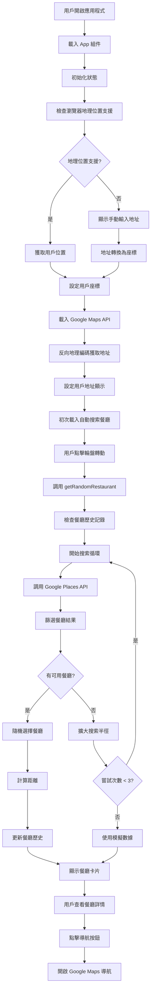
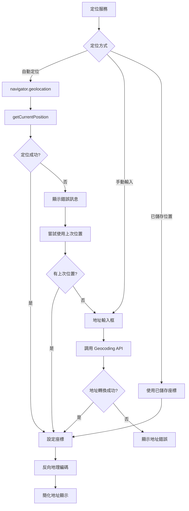
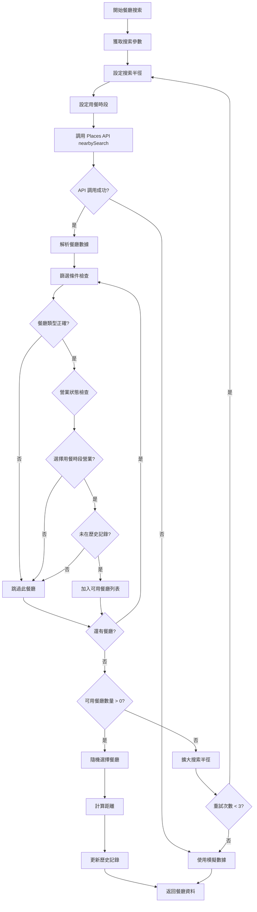
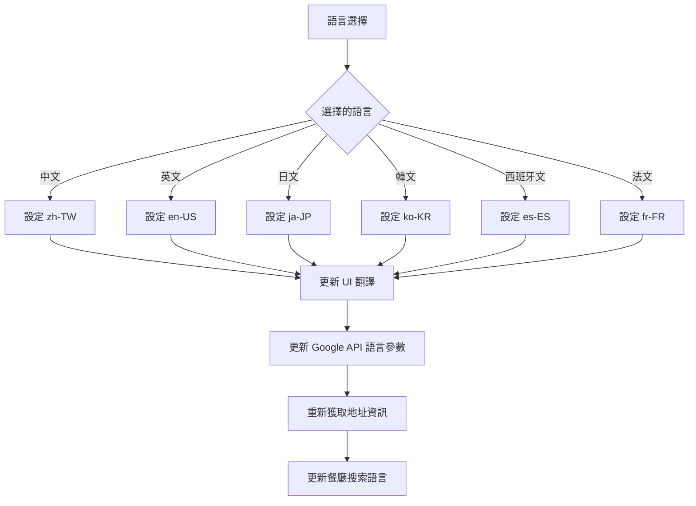
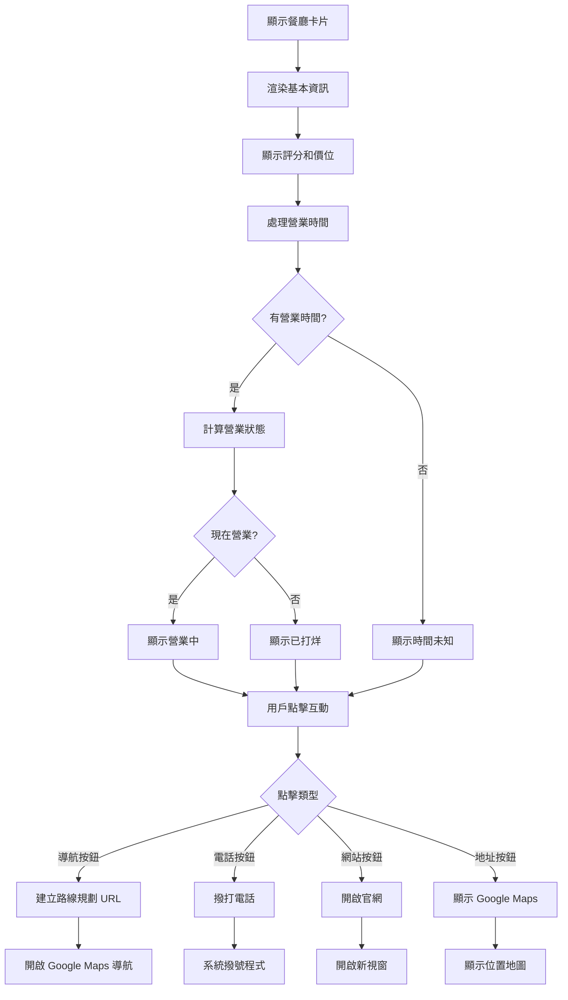
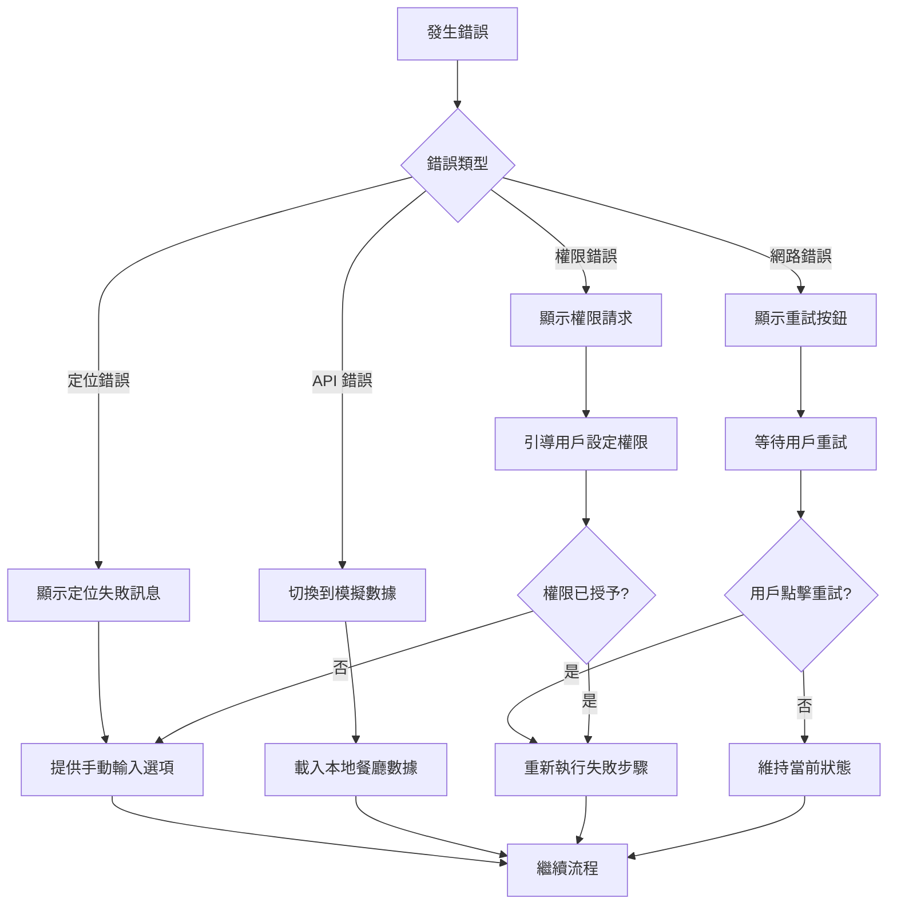
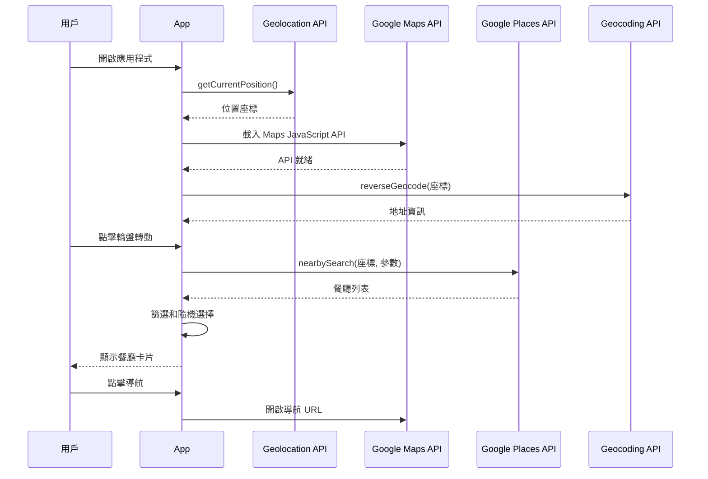

# Restaurant Roulette 調用鏈流程圖

## 主要執行流程

## 分支流程詳解

### 1. 定位服務分支

### 2. 餐廳搜索分支

### 3. 語言處理分支

### 4. 餐廳卡片互動分支

### 5. 錯誤處理分支

## 關鍵函數調用順序

1. **App()** - 主應用組件初始化
2. **getUserLocation()** - 獲取用戶位置
3. **getAddressFromCoordinates()** - 反向地理編碼
4. **handleSpin()** - 處理輪盤轉動
5. **getRandomRestaurant()** - 獲取隨機餐廳
6. **searchNearbyRestaurants()** - 搜索附近餐廳
7. **isRestaurantOpenInTimeSlot()** - 檢查營業狀態
8. **calculateDistance()** - 計算距離
9. **updateRestaurantHistory()** - 更新歷史記錄
10. **RestaurantCard()** - 渲染餐廳卡片

## API 調用鏈

